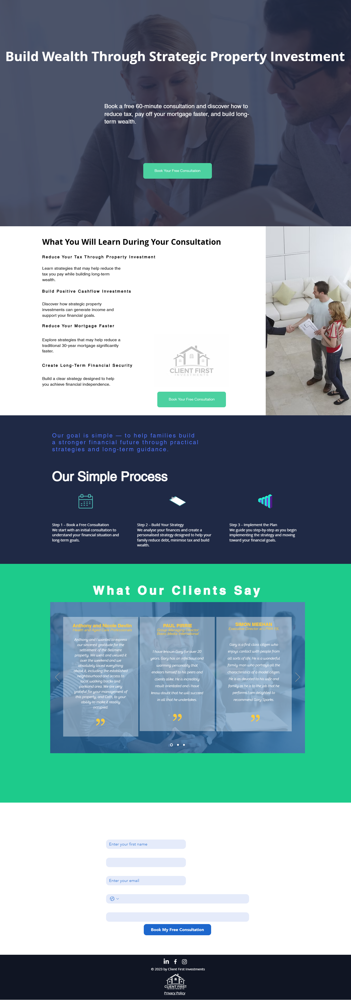
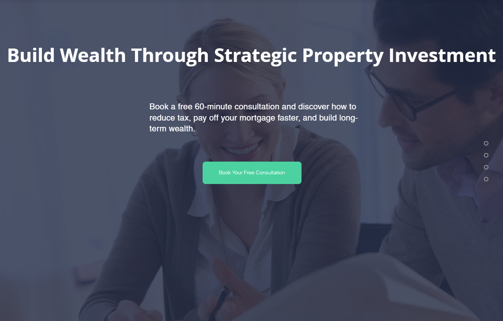
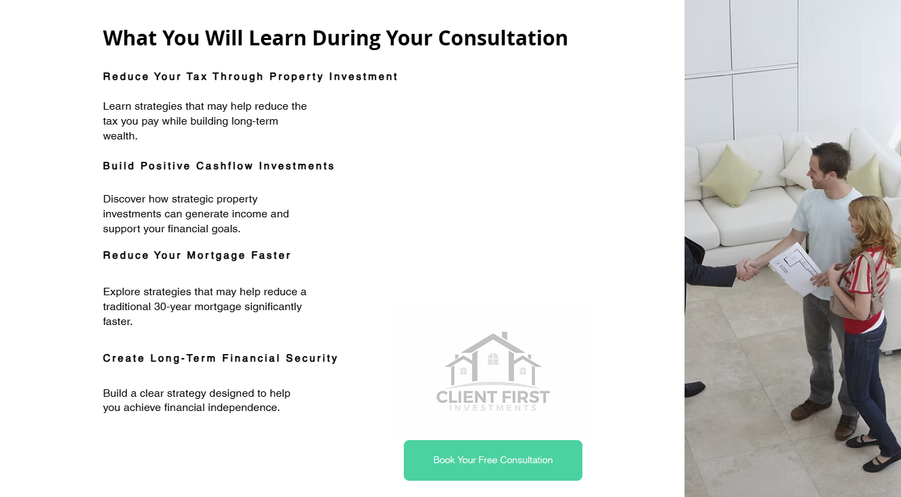
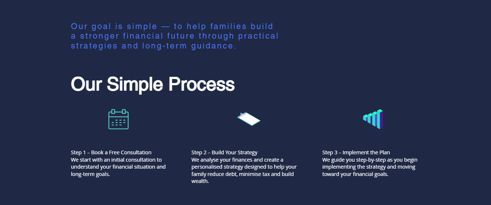
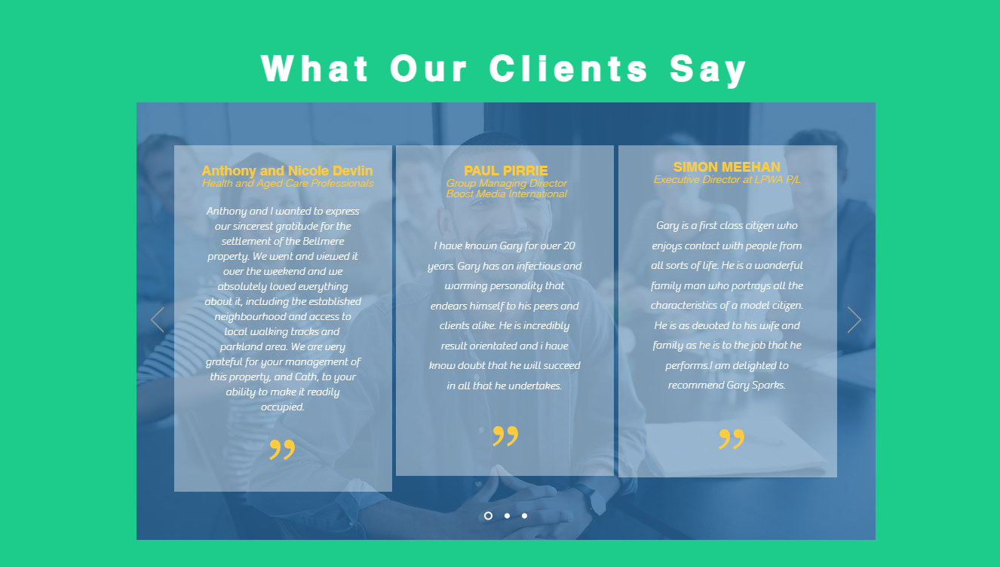

# Landing Page Implementation – Client First Investments

## Project Objective

The goal of this project was to create a high-converting landing page designed to generate consultation bookings for Client First Investments.

---

## Final Landing Page

---

## Strategy Overview

The landing page was structured to guide visitors through a clear conversion journey:

• Strong value proposition  
• Clear explanation of benefits  
• Simple consultation process  
• Social proof through testimonials  
• Lead capture form  

---

## Page Structure

### Hero Section

Clear headline and consultation offer.

---

### Benefits Section

Highlights key outcomes of the consultation.

---

### Consultation Process

Explains how the consultation works.

---

### Testimonials

Builds trust and credibility.

---

## Implementation Approach

The landing page was built using Wix Studio and reused existing website design elements to maintain brand consistency.

Key improvements included:

• Clearer messaging  
• Simplified structure  
• Stronger call-to-action  
• Focused conversion flow  

---

## Outcome

The landing page provides a focused path for visitors to book a consultation and is designed to support future Google Ads and marketing campaigns.
---

# Mobile Experience

## Mobile Hero

---

## Mobile Benefits

---

## Mobile Process

---

## Mobile Form

