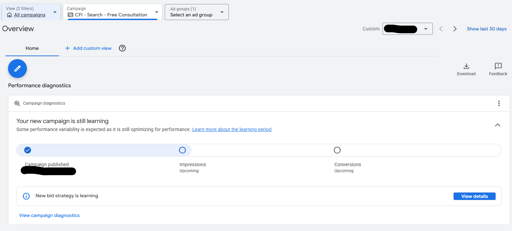
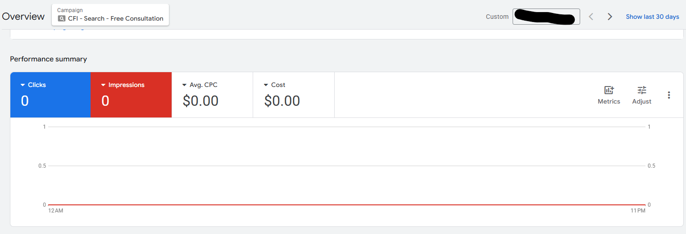
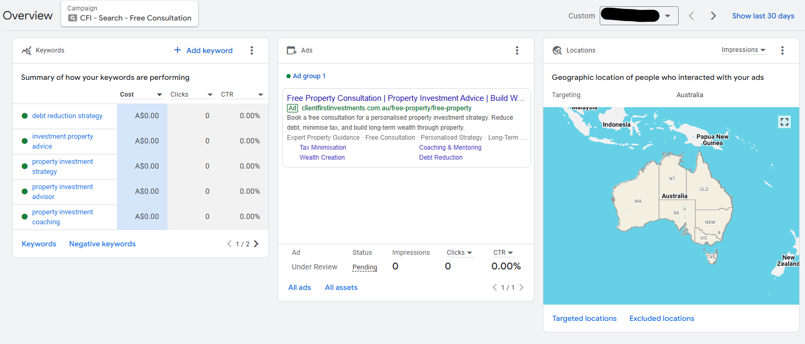

# Campaign Setup

## Objective
Set up the first Google Ads campaign for Client First Investments to generate consultation leads.

## Campaign Details
- Campaign name: CFI - Search - Free Consultation
- Campaign type: Search
- Objective: Leads
- Goal: Page views, Sign-ups
- Bidding strategy: Maximize conversions
- Daily budget: A$20.00 per day

## Targeting
- Location: Australia
- Language: English
- Network: Google Search Network only
- Audience segments: None

## Landing Page
https://www.clientfirstinvestments.com.au/freepropertyinvestmentconsultation

## Keywords
- property investment consultation
- property investment advisor
- property investment strategy
- property investment planning
- investment property advice
- property investment coaching
- wealth creation through property
- debt reduction strategy
- tax minimisation property investment
- book property investment consultation

## Ad Setup
A responsive search ad was created using headlines and descriptions focused on:
- free consultation
- property investment advice
- debt reduction
- tax minimisation
- long-term wealth building

## Extensions
Added sitelinks for:
- Free Consultation
- Tax Minimisation
- Debt Reduction
- Wealth Creation
- Coaching & Mentoring

Added callouts for:
- Free Consultation
- Personalised Strategy
- Long-Term Wealth Planning
- Expert Property Guidance

## Status
Campaign published and currently in learning phase.

## Screenshots

### Campaign Published

### Campaign Overview

### Keywords, Ads, and Location

