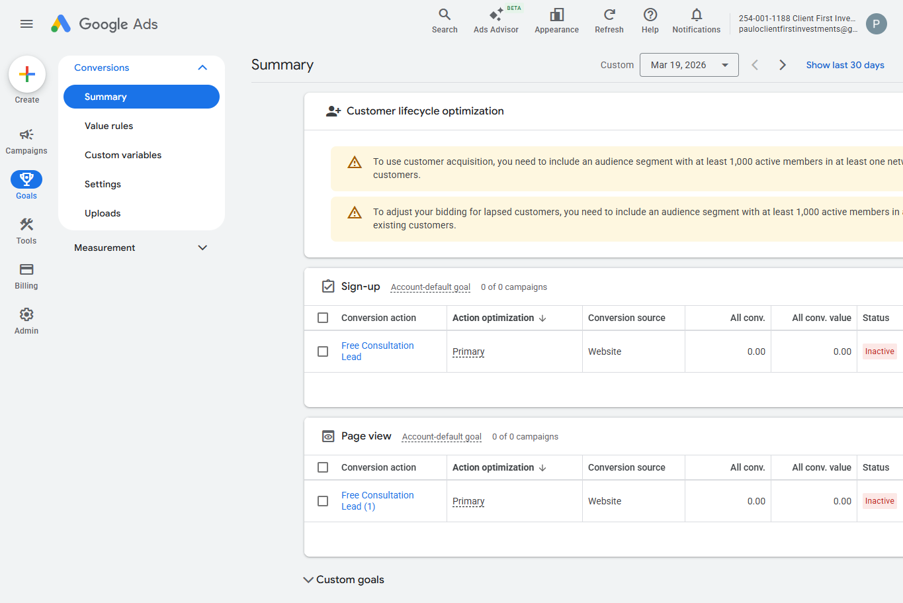
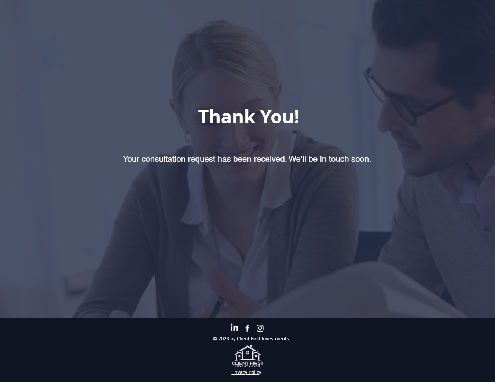

# Conversion Tracking

## Objective
Track form submissions from the Free Property Investment Consultation landing page.

## Tracking Setup
A thank-you page method was used for conversion tracking.

## Funnel Flow
1. User lands on the Free Property Investment Consultation page.
2. User submits the consultation form.
3. User is redirected to the thank-you page.
4. A visit to the thank-you page is tracked as a Google Ads conversion.

## Google Ads Configuration
- Google tag installed on the Wix website
- Conversion type: Page view
- Conversion name: Free Consultation Lead
- Count: One
- Attribution: Data-driven
- Click-through conversion window: 30 days
- Action optimization: Primary

## Wix Configuration
- Created a dedicated thank-you page
- Updated the Wix form to redirect to the thank-you page after submission

## Screenshots

### Google Ads Conversion

### Thank You Page

