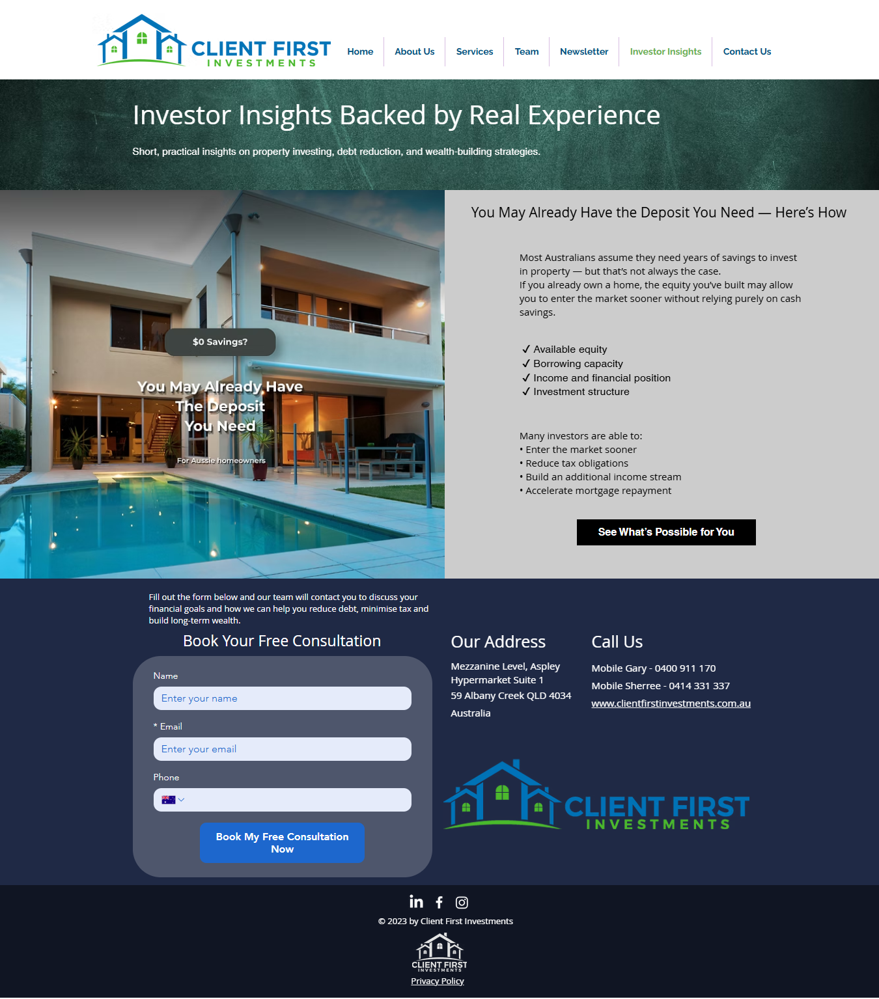

# Investor Insights

## Overview
This project showcases the creation of the Investor Insights page for Client First Investments.

The page was designed to repurpose Facebook ad creatives into structured, educational website content that builds trust and supports lead generation.

---

## What I Did
- Structured the page layout in Wix  
- Reframed ad messaging into educational content  
- Created a reusable format for future ad-based content  
- Implemented clear call-to-action elements  

---

## Why It Matters
Instead of leaving valuable content only on social media, this approach transforms paid campaign assets into long-term website content.

This helps:
- Improve website engagement  
- Build trust with visitors  
- Strengthen lead generation  
- Create reusable marketing assets  

---

## Page Preview

---

## Tools Used
- Wix  
- Canva  
- Meta Ads  
- Content Strategy  
- Conversion Copywriting  
