[Home](index) | [Case Study](clientfirst-case-study) | [About](about)

---
# Client First Investments  
### Website Optimization & Google Ads Setup Case Study
---

## Project Summary

**Client:** Client First Investments  
**Industry:** Property Investment  
**Project Type:** Website Optimization and Lead Generation Setup  
**Focus:** Messaging clarity, conversion improvements, and Google Ads preparation  
**Tools Used:** Wix, Google Ads, GitHub  

---

## Project Overview

This project focused on improving the clarity, structure, and conversion potential of the Client First Investments website while preparing the business for lead generation through Google Ads.

The goal was to simplify messaging, improve user experience, strengthen calls-to-action, and build a cleaner path for consultation bookings through a dedicated landing page and tracked conversion flow.

---

## Key Improvements

### Website Optimization

• Improved headline messaging  
• Clarified value proposition  
• Simplified service explanations  
• Added a clear process section  
• Improved testimonial messaging  
• Strengthened consultation call-to-action  

---

### Service Page Improvements

The following pages were optimized to improve readability and conversion:

• Tax Minimisation  
• Debt Reduction  
• Wealth Creation  
• Coaching & Mentoring  

Each page was restructured with:

• Clearer headlines  
• Improved readability  
• Benefit-focused messaging  
• Stronger calls-to-action  

---

### Landing Page Development

A dedicated landing page was created to support lead generation campaigns.

The page was structured to guide visitors from awareness to booking a consultation using:

• Clear messaging  
• Strong value proposition  
• Step-by-step process  
• Social proof  
• Focused call-to-action  

👉 [View Landing Page Project](09-landing-page-project/landing-page-final.md)

---

### Google Ads Setup

A Google Ads account was created and configured to prepare for paid lead generation campaigns.

Setup work included:

• Google Ads account creation  
• Billing and account configuration  
• Google tag installation on Wix  
• Conversion setup for consultation leads  
• Dedicated thank-you page creation  
• Form redirect setup for cleaner tracking  

---

### Conversion Tracking Setup

A thank-you page tracking method was implemented to measure consultation form submissions more reliably.

The conversion flow was structured as follows:

1. Visitor lands on the consultation landing page  
2. Visitor submits the form  
3. Visitor is redirected to a thank-you page  
4. The thank-you page visit is counted as a Google Ads conversion  

This created a cleaner and more measurable funnel for future ad campaigns.

---

# Homepage Optimization

| Before | After |
|--------|-------|
| 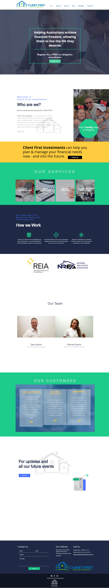 | 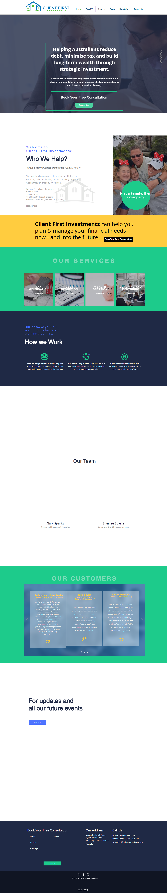 |

---

# Service Page Improvements

| Tax Minimisation | Debt Reduction |
|-----------------|----------------|
| 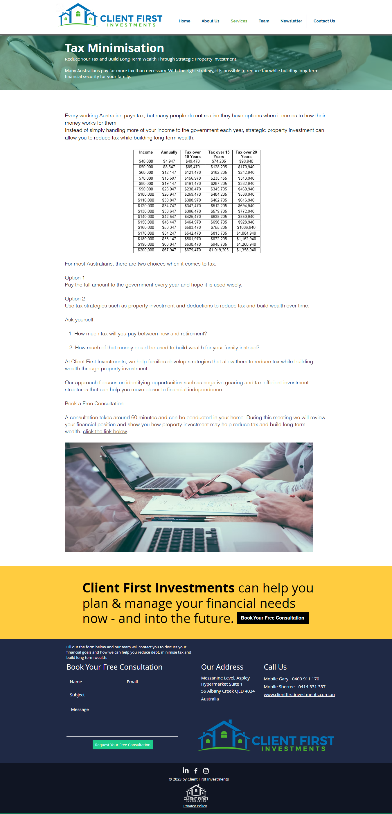 | 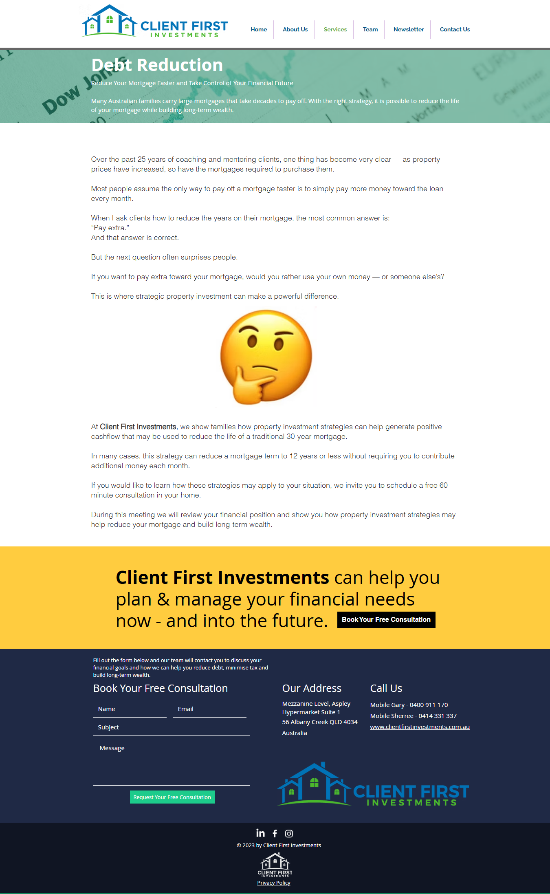 |

| Wealth Creation | Coaching & Mentoring |
|----------------|----------------------|
| 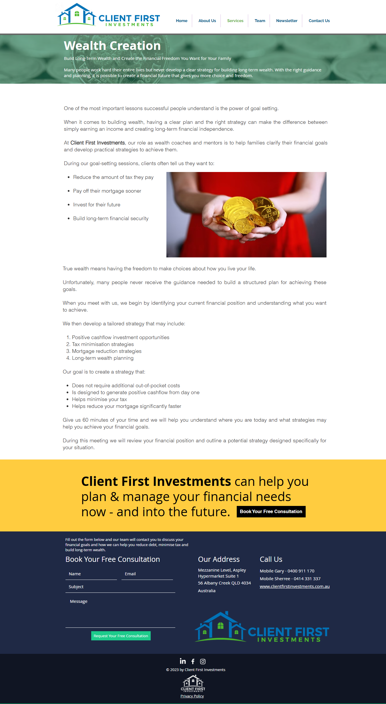 | 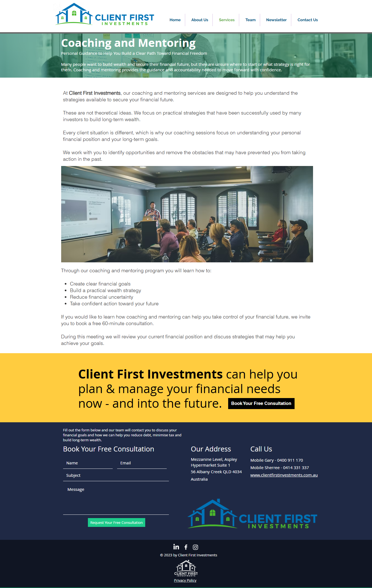 |

---

# Mobile Experience

## Homepage Mobile

| Hero | Services |
|------|----------|
| 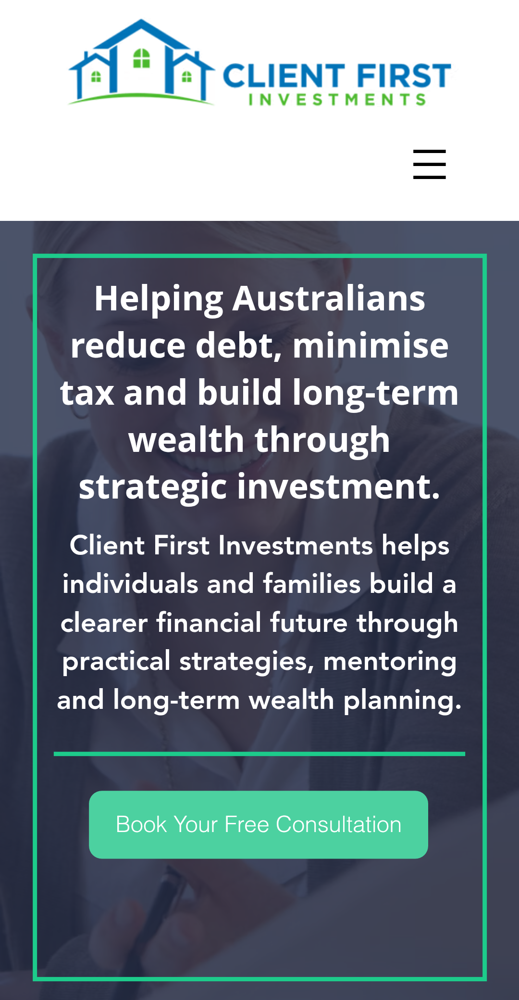 |  |

| Process | Testimonials |
|--------|--------------|
| 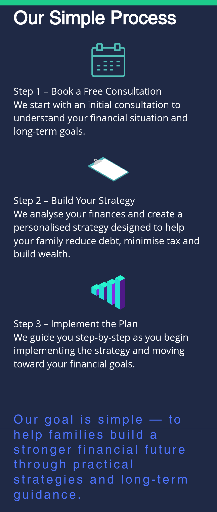 | 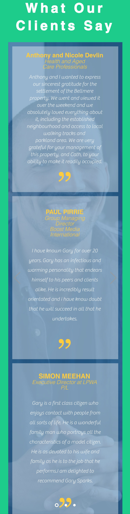 |

---

## Service Pages Mobile

| Tax | Debt |
|-----|------|
| 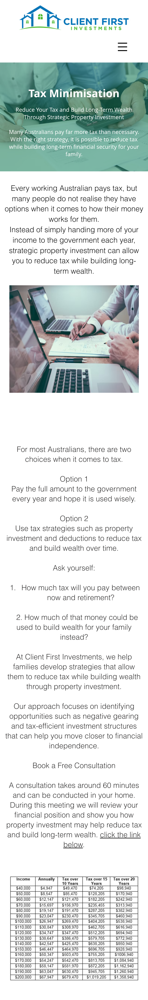 | 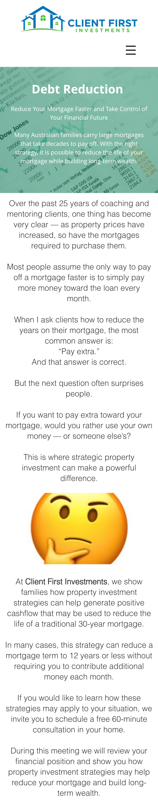 |

| Wealth | Coaching |
|--------|----------|
| 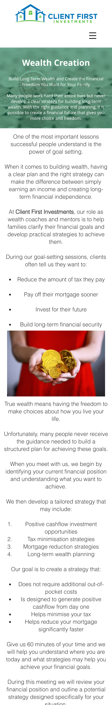 | 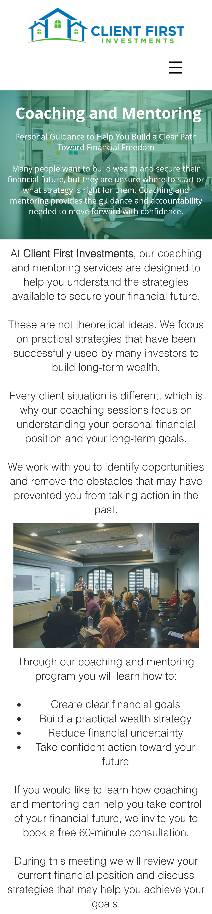 |

---

## Conversion Section (Form)

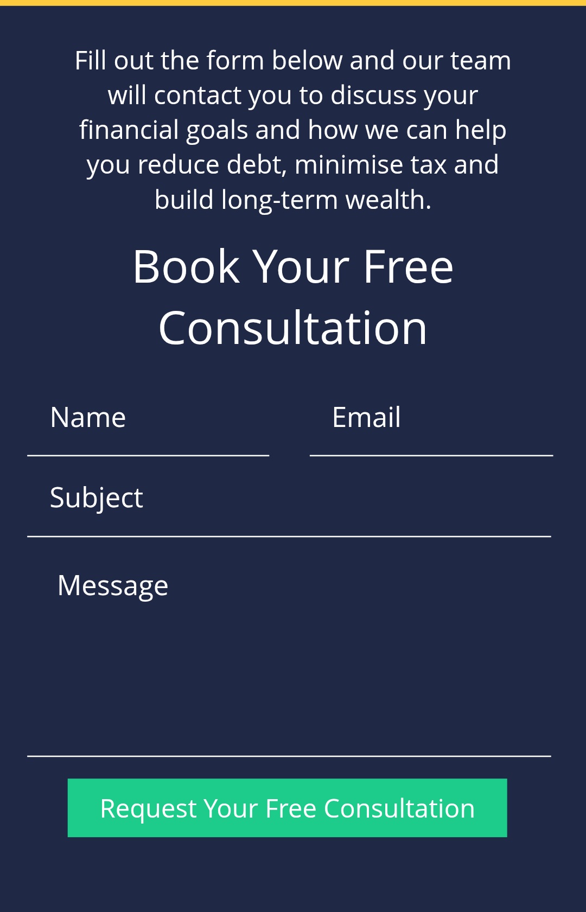

---

## Skills Demonstrated

Website Optimization  
Conversion Rate Optimization (CRO)  
Marketing Messaging Strategy  
Landing Page Strategy  
Google Ads Setup  
Conversion Tracking  
Lead Generation Funnel Setup  

---

## Tools Used

Wix  
Google Ads  
GitHub  
Content Strategy  
Conversion Copywriting  
Conversion Tracking  

---

## Results & Impact

The project created a clearer, more structured path from website visit to consultation inquiry.

Key outcomes:

• Improved homepage clarity  
• Stronger service page messaging  
• Better structured user flow  
• Dedicated landing page for lead generation  
• Google Ads account prepared for campaigns  
• Conversion tracking implemented through thank-you page setup  
• Improved readiness for measurable consultation bookings
